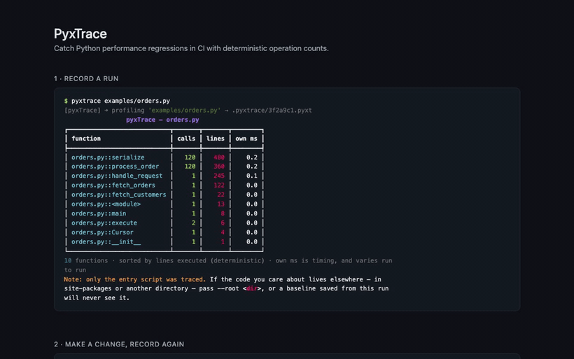

<div align="center">

<h1>PyxTrace</h1>

<p><em>Catch Python performance regressions in CI — deterministically,<br/>so your benchmark gate stops crying wolf.</em></p>

<p>
  <a href="https://pypi.org/project/pyxtrace/"></a>
  <a href="https://github.com/AbhineetSaha/pyxTrace/blob/main/LICENSE"></a>
  <a href="https://github.com/AbhineetSaha/pyxTrace/actions/workflows/ci.yml"></a>
</p>



<p><a href="docs/demo.mp4">Narrated version (MP4, 1 min)</a></p>

</div>

---

## Why

Wall-clock benchmarks are noisy enough to make a pull-request gate unreliable.
Run the same unchanged code seven times and time it, then count the operations
it performed on those same runs (`python benchmarks/overhead.py`):

```
wall-clock       : 2.06ms  2.06ms  2.20ms  2.04ms  2.06ms  2.05ms  2.17ms   → 3.1% spread
operation counts : 3196    3196    3196    3196    3196    3196    3196     → 0.0% spread
```

That 3.1% is on an idle local machine, which is the *best* case — a shared CI
runner with a noisy neighbour is worse, and smaller workloads are worse still
(sub-millisecond ones swing well past 15%). Meanwhile the counts are not
"stable," they are identical.

So on wall-clock you either set the threshold tight and get flaky failures, or
set it wide and miss real regressions. Most teams end up deleting the job.

PyxTrace counts **operations** — function calls and lines executed — instead of
measuring time. Those counts are byte-for-byte reproducible, so a 10% threshold
actually means something. Sampling profilers cannot do this: sampling is
non-deterministic by construction.

## Install

```bash
pip install pyxtrace
```

One dependency (`rich`). Python 3.10+.

## Use

Record a run per commit, then compare commits:

```bash
pyxtrace examples/orders.py            # → .pyxtrace/<commit sha>.pyxt
# ... commit your change ...
pyxtrace examples/orders.py
pyxtrace diff HEAD~1 HEAD              # any git ref, or a .pyxt path
```

`diff` exits **1** when something regressed, so it drops straight into CI.

### What a caught regression looks like

The bundled example has a batched customer lookup. Set `PYXTRACE_NPLUSONE=1` and
it fetches each order's customer individually instead:

```
⚠  orders.py::process_order  +120 calls to other functions  (same code, more work)
   process_order() runs 120x and makes 1 more call(s) to fetch_customer() each time
   Attributed to:
     orders.py::fetch_customer   0 → 120 calls   new

⚠  orders.py::execute  +5,950% operations  (6 → 363)

⚠  orders.py::fetch_customer  new operations  (0 → 240)

✗ FAIL — 3 function(s) regressed
```

`process_order` ranks first: it is where the extra work was introduced.
`execute` and `fetch_customer` merely run more often as a consequence.

Every line there is arithmetic over exact counts, and there is no confidence
score because there is nothing to be uncertain about. Note also what it does
**not** say. "Runs 120x and makes 1 more call each time" is a measurement;
calling it an N+1 would be a conclusion, and one input size cannot support it.
The same shape is produced by a function that simply does more work per call.
Reading it is your job, and you have the counts to do it with.

### A single run

```bash
pyxtrace examples/orders.py
```

```
                pyxTrace – orders.py
┏━━━━━━━━━━━━━━━━━━━━━━━━━━━━┳━━━━━━━┳━━━━━━━┳━━━━━━━━┓
┃ function                   ┃ calls ┃ lines ┃ own ms ┃
┡━━━━━━━━━━━━━━━━━━━━━━━━━━━━╇━━━━━━━╇━━━━━━━╇━━━━━━━━┩
│ orders.py::process_order   │   120 │   360 │    0.2 │
│ orders.py::handle_request  │     1 │   245 │    0.1 │
│ orders.py::fetch_orders    │     1 │   122 │    0.0 │
└────────────────────────────┴───────┴───────┴────────┘
```

`calls` and `lines` are deterministic. `own ms` is timing and varies run to run —
it is shown for orientation and is never what `diff` gates on.

## In CI

Run files are keyed by commit sha, so a PR gate records the base commit and
the head and diffs them by name:

```yaml
- uses: actions/checkout@v4
  with: { fetch-depth: 0 }                  # the base commit has to be present
- run: pip install pyxtrace
- run: pyxtrace benchmarks/workload.py      # HEAD → .pyxtrace/<sha>.pyxt
- run: |
    git checkout -q ${{ github.event.pull_request.base.sha }}
    pyxtrace benchmarks/workload.py         # base → .pyxtrace/<sha>.pyxt
    git checkout -q -
- run: pyxtrace diff ${{ github.event.pull_request.base.sha }} HEAD --threshold 10
```

Because the counts are exact, the base run can be recorded once and cached
(`actions/cache` on `.pyxtrace/`) instead of re-run per PR; the same commit
always produces the same bytes.

## Options

| Command | What it does |
|---|---|
| `pyxtrace run SCRIPT` | Profile → `.pyxtrace/<commit sha>.pyxt` (`run` is optional; `-o` overrides) |
| `pyxtrace diff BASE HEAD` | Compare two commits (or `.pyxt` paths); exit 1 on regression |
| `--threshold N` | Percent growth that fails the gate (default 10) |
| `--min-ops N` | Ignore growth below N operations (default 10), so a 2→3 line change is not an alarm |
| `--root DIR` | Profile this directory instead of the script's own, for an installed or out-of-tree package |

## Overhead

Measured on `fib(22)`, a deliberately call-heavy worst case
(`python benchmarks/overhead.py`):

| | `fib(22)` | Real code |
|---|---|---|
| **PyxTrace (default profiling path)** | **~49x** | **~9x** |
| `cProfile` (stdlib, for reference) | ~8x | ~3.4x |

`fib(22)` is a deliberate worst case: it does almost nothing between calls, so
the per-event cost has nothing to amortise against. The real-code column is
sqlglot parsing 838 SQL statements, which is the number to plan around. Trace a
representative benchmark script, not your whole test suite.

## Limits

Stated plainly, because a profiler that hides these is worse than none:

- **Work inside C is invisible.** PyxTrace counts Python operations. A
  regression that lives in a C extension, a regex, NumPy, a database driver, or
  any I/O wait produces no extra Python operations and will not be caught. A
  measured example: moving the same workload onto a backtracking regex made it
  230,000x slower with byte-identical counts, and the gate passed. This is the
  mirror image of what sampling profilers cannot do, and it is the first thing
  to check before adopting PyxTrace. It is strongest on pure-Python CPU-bound
  code: parsers, template engines, serializers, business logic.
- **Subprocesses are not traced.** Threads and `asyncio` are: coroutines run on
  the event loop's thread, and worker threads are covered via
  `threading.settrace`. A thread started before tracing begins is not.
- **Only code under one root directory** is profiled — the script's own
  directory by default, or `--root DIR`. Anything outside it is skipped, and a
  run that captured nothing but the entry script says so.
- **Operation counts are a proxy for cost, not a measure of it.** An algorithmic
  change can cut operations and still be slower. Gate on counts, then confirm
  with a real timer.
- **Not for production.** This is a deterministic tracer for CI. To profile a
  live process, use [py-spy](https://github.com/benfred/py-spy).

## When to use something else

| You want | Use |
|---|---|
| Profile a running production process | [py-spy](https://github.com/benfred/py-spy) |
| Find where memory is allocated | [memray](https://github.com/bloomberg/memray) |
| A readable one-off wall-clock profile | [pyinstrument](https://github.com/joerick/pyinstrument) |
| A timeline / flame-graph UI | [VizTracer](https://github.com/gaogaotiantian/viztracer) |
| **Know whether this PR made things slower** | **PyxTrace** |

## Contributing

```bash
git clone https://github.com/AbhineetSaha/pyxTrace.git
cd pyxTrace
python -m venv .venv && source .venv/bin/activate
pip install -e ".[dev]"

pytest -q                        # tests
python benchmarks/overhead.py    # overhead + determinism gate
```

The overhead gate fails past 150x. If a change pushes it over, that is the change
to reconsider — this tool is only useful if people can afford to run it.

## License

MIT — see [`LICENSE`](LICENSE).
