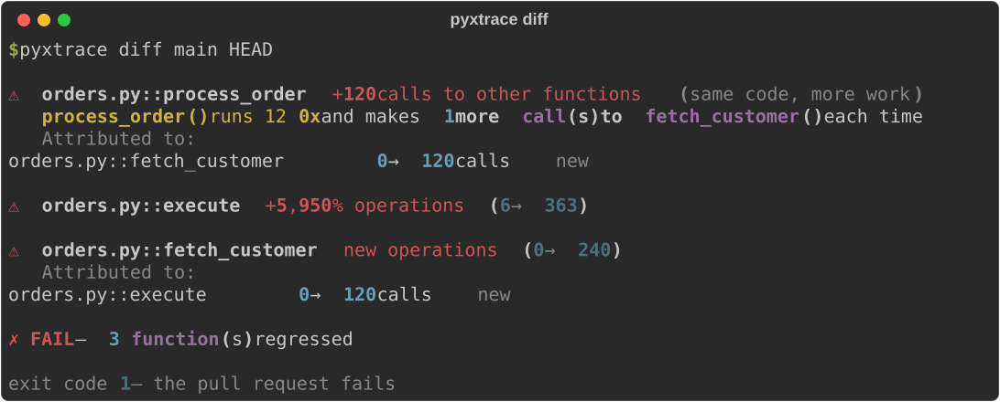

<div align="center">

<h1>PyxTrace</h1>

<p><em>Catch Python performance regressions in CI — deterministically,<br/>so your benchmark gate stops crying wolf.</em></p>

<p>
  <a href="https://pypi.org/project/pyxtrace/"></a>
  <a href="https://github.com/AbhineetSaha/pyxTrace/blob/main/LICENSE"></a>
  <a href="https://github.com/AbhineetSaha/pyxTrace/actions/workflows/ci.yml"></a>
</p>



</div>

---

## Why

Wall-clock benchmarks are noisy enough to make a pull-request gate unreliable.
Run the same unchanged code seven times and time it, then count the operations
it performed on those same runs (`python benchmarks/overhead.py`):

```
wall-clock       : 2.06ms  2.06ms  2.20ms  2.04ms  2.06ms  2.05ms  2.17ms   → 3.1% spread
operation counts : 3196    3196    3196    3196    3196    3196    3196     → 0.0% spread
```

That 3.1% is on an idle local machine, which is the *best* case — a shared CI
runner with a noisy neighbour is worse, and smaller workloads are worse still
(sub-millisecond ones swing well past 15%). Meanwhile the counts are not
"stable," they are identical.

So on wall-clock you either set the threshold tight and get flaky failures, or
set it wide and miss real regressions. Most teams end up deleting the job.

PyxTrace counts **operations** — function calls and lines executed — instead of
measuring time. Those counts are byte-for-byte reproducible, so a 10% threshold
actually means something. Sampling profilers cannot do this: sampling is
non-deterministic by construction.

## Install

```bash
pip install pyxtrace
```

Two dependencies (`rich`, `typer`). Python 3.10+.

## Use

Record a baseline, make a change, compare:

```bash
pyxtrace examples/orders.py -o before.pyxt
# ... your change ...
pyxtrace examples/orders.py -o after.pyxt
pyxtrace diff before.pyxt after.pyxt
```

`diff` exits **1** when something regressed, so it drops straight into CI.

### What a caught regression looks like

The bundled example has a batched customer lookup. Set `PYXTRACE_NPLUSONE=1` and
it fetches each order's customer individually instead — the classic N+1:

```
⚠  orders.py::process_order  +120 calls to other functions  (same code, more work)
   Attributed to:
     orders.py::fetch_customer   0 → 120 calls   new
   Pattern detected: N+1 — process_order() runs 120x and calls fetch_customer() 1x each
     120 total calls to fetch_customer(), was 0. Batch it outside the loop.

⚠  orders.py::execute  +5,950% operations  (6 → 363)

✗ FAIL — 3 function(s) grew by more than 10%
```

Note it blames `process_order` — where the N+1 was introduced — rather than
`execute`, which merely runs more often as a consequence.

That detection is arithmetic over exact call counts, not a model guess. There is
no confidence score because there is nothing to be uncertain about.

### A single run

```bash
pyxtrace examples/orders.py
```

```
                pyxTrace – orders.py
┏━━━━━━━━━━━━━━━━━━━━━━━━━━━━┳━━━━━━━┳━━━━━━━┳━━━━━━━━┓
┃ function                   ┃ calls ┃ lines ┃ own ms ┃
┡━━━━━━━━━━━━━━━━━━━━━━━━━━━━╇━━━━━━━╇━━━━━━━╇━━━━━━━━┩
│ orders.py::process_order   │   120 │   360 │    0.2 │
│ orders.py::handle_request  │     1 │   245 │    0.1 │
│ orders.py::fetch_orders    │     1 │   122 │    0.0 │
└────────────────────────────┴───────┴───────┴────────┘
```

`calls` and `lines` are deterministic. `own ms` is timing and varies run to run —
it is shown for orientation and is never what `diff` gates on.

## In CI

```yaml
- run: pip install pyxtrace
- run: pyxtrace benchmarks/workload.py -o current.pyxt
- run: pyxtrace diff baseline.pyxt current.pyxt --threshold 10
```

Commit `baseline.pyxt` to the repo and regenerate it when a change is
intentional. Because the file is byte-stable, the diff in code review shows
exactly which functions got more expensive.

## Options

| Command | What it does |
|---|---|
| `pyxtrace run SCRIPT -o out.pyxt` | Profile and write a run file (`run` is optional) |
| `pyxtrace diff A.pyxt B.pyxt` | Compare two runs; exit 1 on regression |
| `--threshold N` | Percent growth that fails the gate (default 10) |
| `--min-ops N` | Ignore growth below N operations (default 100), so a 2→3 line change is not an alarm |
| `--events` | Write the raw JSONL event stream instead of a run file |
| `--capture-returns` | Record return values. **Off by default — these can contain secrets** |
| `--memory` | Sample heap usage via `tracemalloc` (slower) |

## Overhead

Measured on `fib(22)`, a deliberately call-heavy worst case
(`python benchmarks/overhead.py`):

| | Overhead |
|---|---|
| **PyxTrace (default profiling path)** | **~44x** |
| `cProfile` (stdlib, for reference) | ~8x |
| `--events` JSONL stream | ~400x |

Real code does more work between calls, so the practical figure is lower. Trace a
representative benchmark script, not your whole test suite.

## Limits

Stated plainly, because a profiler that hides these is worse than none:

- **Single-threaded only.** `sys.settrace` is per-thread; threads, `asyncio`
  tasks, and subprocesses are not traced.
- **Only code under the script's own directory** is profiled. Library internals
  are excluded by design — they are not what your PR changed.
- **Operation counts are a proxy for cost, not a measure of it.** An algorithmic
  change can cut operations and still be slower. Gate on counts, then confirm
  with a real timer.
- **Not for production.** This is a deterministic tracer for CI. To profile a
  live process, use [py-spy](https://github.com/benfred/py-spy).

## When to use something else

| You want | Use |
|---|---|
| Profile a running production process | [py-spy](https://github.com/benfred/py-spy) |
| Find where memory is allocated | [memray](https://github.com/bloomberg/memray) |
| A readable one-off wall-clock profile | [pyinstrument](https://github.com/joerick/pyinstrument) |
| A timeline / flame-graph UI | [VizTracer](https://github.com/gaogaotiantian/viztracer) |
| **Know whether this PR made things slower** | **PyxTrace** |

## Contributing

```bash
git clone https://github.com/AbhineetSaha/pyxTrace.git
cd pyxTrace
python -m venv .venv && source .venv/bin/activate
pip install -e ".[dev]"

pytest -q                        # tests
python benchmarks/overhead.py    # overhead + determinism gate
```

The overhead gate fails past 50x. If a change pushes it over, that is the change
to reconsider — this tool is only useful if people can afford to run it.

## License

MIT — see [`LICENSE`](LICENSE).
